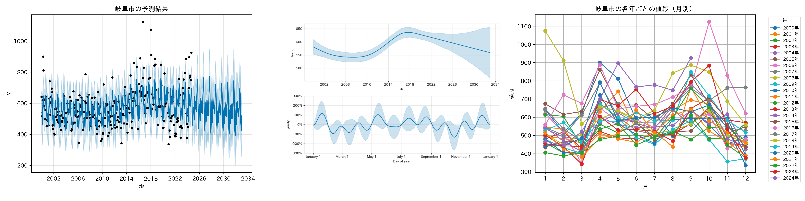
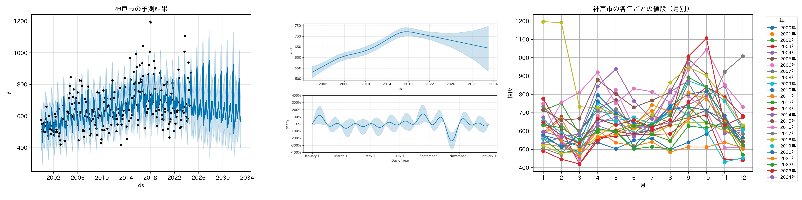
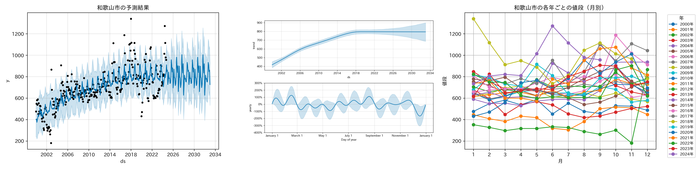
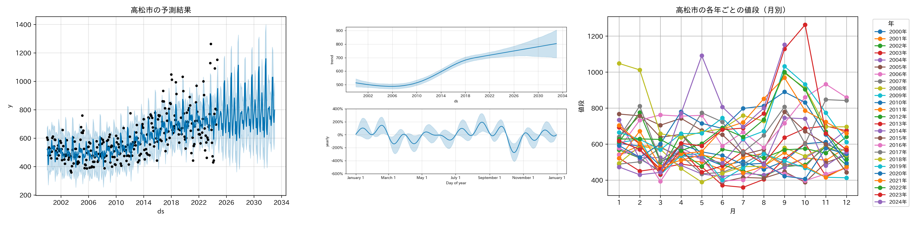

# Prophetを用いた地域別のブロッコリーの価格予測と分析

[利用規約 | 政府統計の総合窓口](https://www.e-stat.go.jp/terms-of-use) に従い、データを利用します。

今回は、[小売物価統計調査 小売物価統計調査（動向編）主要品目の都市別小売価格－都道府県庁所在市及び人口15万以上の市(2000年1月～) | 統計表・グラフ表示 | 政府統計の総合窓口](https://www.e-stat.go.jp/dbview?sid=0003421913)のデータを加工して分析を行います。

出典：政府統計の総合窓口(e-Stat)（https://www.e-stat.go.jp/　）

---
### 札幌市

### 青森市

### 盛岡市

### 秋田市

### 山形市

### 福島市

### 仙台市

### 水戸市

### 宇都宮市

### 前橋市

### 特別区部

### 千葉市

### 横浜市

### 甲府市

### 富山市

### 金沢市

### 福井市

### 長野市

### 岐阜市

### 名古屋市

### 津市

### 大津市

### 京都市

### 大阪市

### 神戸市

### 奈良市

### 和歌山市

### 鳥取市

### 松江市

### 山口市

### 広島市

### 徳島市

### 高松市

### 高知市

### 福岡市

### 佐賀市

### 長崎市

### 大分市

### 宮崎市

### 鹿児島市

### 那覇市
